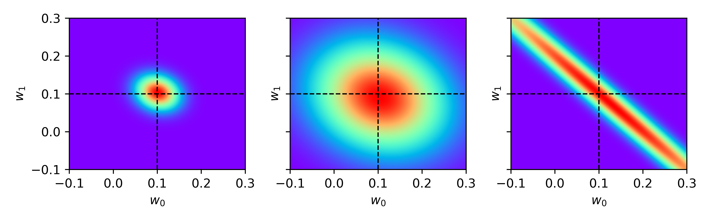

# Simulation 01 - Visualizing Uncertainty

## 1. Description
In this analysis, we illustrate the sampling uncertainty unaccounted for in a frequentist take on linear regression. 

Consider a simple linear regression with two input features, whereby $\{Y_t\}$ is assumed to be an independent stochastic process with a Gaussian likelihood function. We therefore model the target signal as a deviation from the interpolant under a zero-mean additive noise process,

$$
\begin{align}
    \Pr(y_t \vert \textbf{x}_{t}, \textbf{w}, \xi) = \mathcal{N}(f(\textbf{x}_{t}, \textbf{w}), \xi^{-1}), \quad \forall t,
\end{align}
$$

where $f(\textbf{x}_{t}, \textbf{w}) = w_0 x_{0, t} + w_1 x_{1, t}$ is the interpolant and $\xi$ is the finite precision (inverse variance) of the intrinsic noise.

Under the assumption that our observed data points are drawn independently from the above, if we seek to describe the expected value of $Y_t$, the optimal in-sample estimate is provided by the coefficient vector that maximizes the likelihood. Let us consider a case where the true coefficient vector and noise precision are given by $\textbf{w}^{\top} = [0.1, 0.1]$ and $\xi = 2$, respectively. We carry out a Monte-Carlo simulation whereby samples of both input features are drawn from a standard Gaussian (i.e., with correlation coefficient $\rho$), then the maximum likelihood estimates for the regression coefficients are obtained for each. Initially, we use a sample size of $500$ and set $\rho=0$, and further explore reducing the sample size to $50$ and then setting $\rho=0.99$, independently.

## 2. Results
We plot the empirical distributions of parameter estimates obtained by running the Monte-carlo simulation. The results shown in the left panel were obtained with a sample size of 500 and $\rho=0$. In the center panel, the sample size was reduced to $50$ and finally in the right panel, the sample size was reverted to $500$ but with collinearity induced such that $\rho=0.99$.

The key observation here is that the estimated regression coefficients, and hence the derived market payments, are subject to sampling uncertainty. Specifically, as the sample size decreases, the variance in the estimates increases, and in an extreme case where collinearity tends towards perfect correlation, it becomes somewhat arbitrary how the coefficients are distributed between features. Note that, both parameter estimates do indeed remain centred around the true value, implying collinearity does not systematically bias the estimated contribution.

  