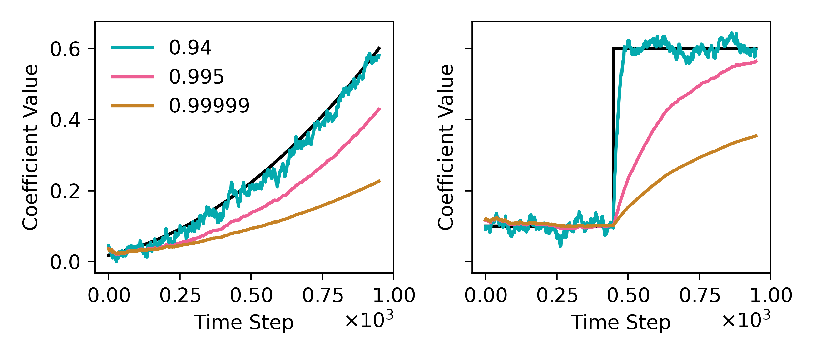

# Simulation 03 - Nonstationary Processes

## 1. Description
In this analysis, we illustrate the utility of exponential forgetting (i.e., likelihood flattening) in the context of Bayesian regression analysis. 

As a basis, consider the simple linear regression as described in `sim01-visualizing-uncertainty`, with the extension that we will now induce nonstationarities by letting the *true* parameters vary with time. Still assuming a Gaussian likelihood, we place a zero-mean isotropic Gaussian prior over the parameters, which renders a posterior distribution with the same functional form. We further assume the prior to be infinitely broad, thereby reducing the posterior mean to the coefficient vector obtained by maximizing the likelihood function. We carry out a Monte-Carlo simulation whereby samples of both input features are drawn from independent standard Gaussians, recording the empirical mean of the parameter estimates at each time step for various forgetting factors, $\tau$. We consider the following two cases: (1) $w_0$ is constant over time, whilst $w_1$ incurs a step change; and (2) both $w_0$ and $w_1$ exhibit smooth nonstationarity.

## 2. Results
We plot the time-varying empirical mean parameter estimates obtained by running the Monte-carlo simulation. The results shown in the top and bottom two panels correspond to those obtained for the first case (i.e., $w_0$ is constant whilst $w_1$ incurs a step change) and the second case (i.e., wherein both parameters exhibit smooth nonstationarities), respectively. The sample size was fixed at $500$, with $\rho=0$. Red dashed lines denote the \textit{true} parameter values; the solid lines correspond to a particular $\tau$ indicated by the color bar.

In practice, $\tau$ is usually set to a value close to $1$, reflecting the fact that our beliefs often decay gradually. Observe that, as $\tau \mapsto 1$, the prior information available at time $t$ becomes identical to the posterior at time $t − 1$, whereas when $\tau = 0$, all of the previous information is forgotten and we resort to the original prior. For simplicity, we treat $τ$ as a time-invariant hyperparameter, however for a full Bayesian treatment one could also infer its value jointly, together with the other parameters.

  
