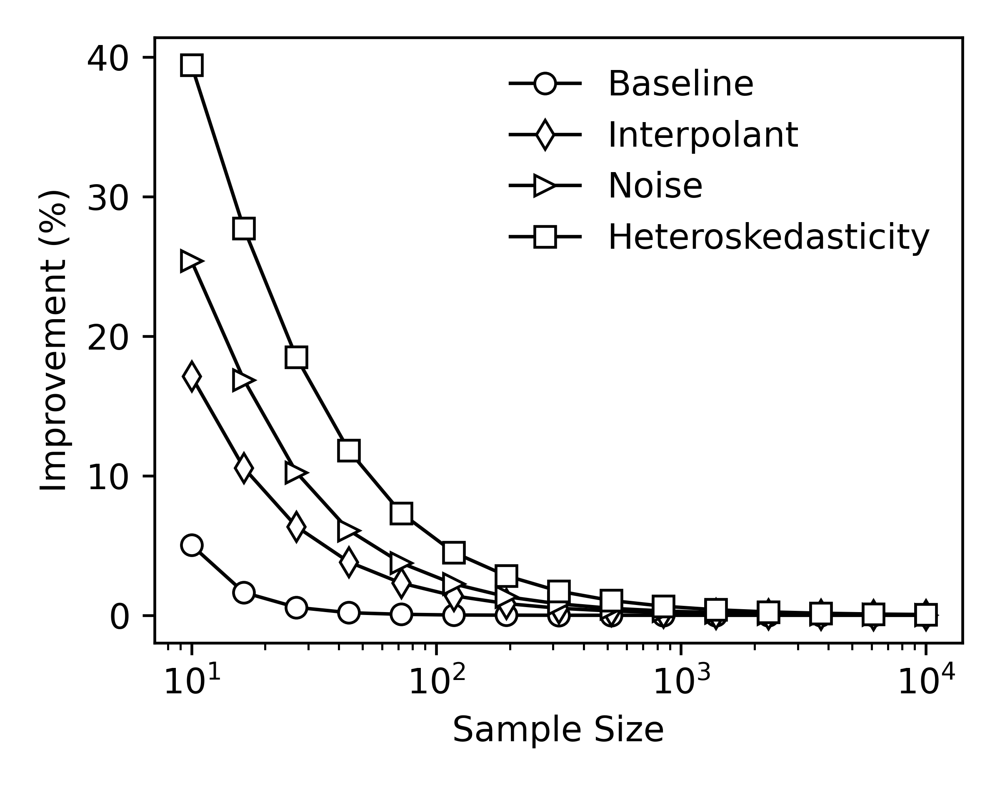

# Simulation 04 - Negative Log Likelihood Ratio

## 1. Description
In this analysis, we illustrate the benefit to the central agent of merely facilitating Bayesian regression analyses. We perform a Monte-Carlo simulation whereby we clear the market $10^3$ times for several different sample sizes, and record the expected negative logarithm of the predictive likelihood on $10^3$ out-of-sample observations for each. This is carried out using both maximum likelihood estimation and Bayesian regression analysis for each level of misspecification.

## 2. Results
  
