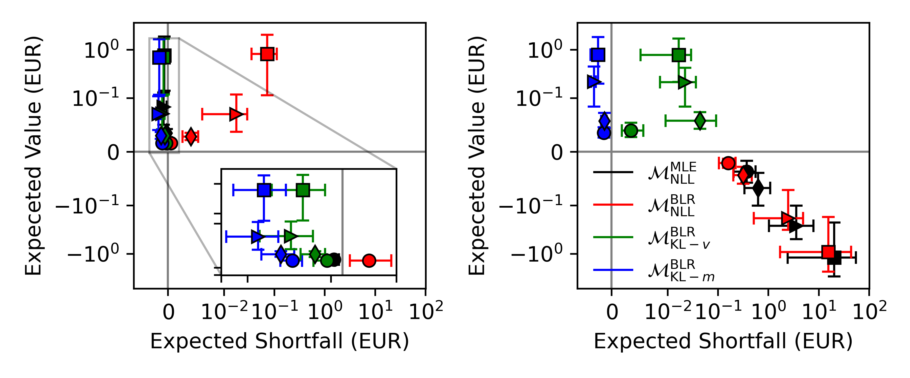

# Simulation 05 - Visualizing Revenue

## 1. Description
For the simple setup described in `sim01-visualizing-uncertainty` we plot the two-sided confidence intervals with a 95% confidence level for both the expected value
and expected shortfall (i.e., with quantile parameter $α = 0.05$) of the revenue received by the owner
of $x_{2,t}$, for each setup, that is, `baseline` (circle), `interpolant` (diamond), `noise` (triangle) and `heteroskedasticity`(square).

## 2. Results
  
